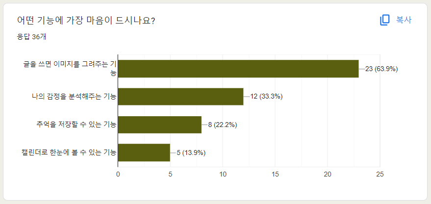

# 📝 당일 (TODAY)


<br /><br />

# 목차

1. [개요](#개요)
2. [서비스 수요조사](#서비스-수요조사)
3. [프로젝트 소개](#프로젝트-소개)
4. [서비스 화면](#서비스-화면)
5. [기술 소개](#기술-소개)
6. [협업 환경](#협업-환경)
7. [팀원 소개](#팀원-소개)

<br /><br />

# 개요

**SSAFY 10기 2학기 자율 프로젝트**

저희 서비스 **당일**은 `"당신의 그림일기"`와 `"오늘의 일기"`의 두가지 의미를 띄고있는 서비스 입니다.

최근 MZ세대 사이에서 일기 앱이 큰 인기를 끌고있는 흐름이 두드러지고 있습니다. 전 세계적으로 500만 명 이상의 사용자를 모으고 있으며, 또한 오래 기억하고 싶은 순간을 그림으로 그리면 더 오래 기억에 남는다는 연구 결과도 있습니다.

이러한 사회적 현상에 주목하여 **'당일'** 은 사용자가 하루의 에피소드를 그림과 함께 기록함으로써 `과거의 기억을 더욱 생생하게 회상`할 수 있도록 돕고, `레트로 감성`을 선호하는 MZ세대를 겨냥하여, `일상을 기록하고 표현하는 새로운 방식을 제공`합니다.

이에 따라 **'당일'** 은 사용자들이 `간편하게 일기를 작성`하고, `진정성 있는 자기 표현을 할 수 있는 공간을 제공`하고자 그림일기 앱을 기획하게 되었습니다.

개발기간 : 2024.04.08 ~ 2024.05.20 (6주)

<br /><br />

# 서비스 수요조사

**24.04.19 한밭대학교 재학생 대상 서비스 수요조사**

저희는 실제 한 대학교의 재학생들을 대상으로 일기 어플에 대한 관심 여부를 설문조사했습니다. 이 설문조사에는 재학생 약 40명이 참여해주셨습니다.

조사 결과, **당일** 앱에 대해 **과반수 이상이 관심**을 보였으며, `'일기를 쓰고는 싶은데 귀찮아서 안쓰게 됨 전용 어플이 있다면 잘 쓸 듯'`, `'일기는 쓰고 싶은데 귀찮고 번거롭지 않았으면 좋겠다'` 등의 **긍정적**인 반응이 많았습니다.

- 설문조사 Google-Form

  

- 설문결과

  
  
  
  

  수요조사의 의견들을 반영하여 기존 기획에 더해 `화풍의 다양성`을 추가하여 4가지의 화풍을 제시하고 사용자의 선택에 따라 일기를 생성주는 기능을 추가하였습니다.

<br /><br />

# 프로젝트 소개

### 📋 서비스명

- 당일 (TODAY)

### 🎯 페르소나

- 자신만의 공간에서 솔직한 이야기를 나누며, 그림과 텍스트를 통해 자신의 감정을 솔직하게 표현하고 레트로 감성을 선호하는 일상 속에서 의미를 찾고 싶어하는 사용자

### 🎵 주요 서비스

- `그림 일기 생성` : 사용자가 그 날의 일기를 텍스트로 작성하면 알기를 분석해 하루를 하나의 그림으로 반환 & 완성된 그림일기를 사진으로 저장
- `캘린더` : 사용자가 작성한 일기들 중 해당 날짜에 속하는 하루를 대표하는 이미지가 캘린더에 표시되고 한 달간의 그림 일기를 도감 형식으로 제공
- `감정, 성향 분석` : 사용자가 작성한 일기의 내용을 바탕으로 사용자의 그 날 감정을 분석해 한 달, 하루동안 나의 감정이 어땠는지 통계로 확인

### 🗺️ 배포 주소

https://dangil.store/ <br />

### 🛠️ 기술 스택

- ⚙ Management Tool

  
  
  
  
  

- 🖥 IDE

  
  

- 📨 Infra

  
  
  
  
  
  
  
  
  

- 📱 Frontend

  
  
  
  
  
  
  

- 💾 Backend

  
  
  
  
  
  
  
  

- 📡 AI

  
  

- 📡 API

  
  
  

### 📑 기능 명세서


### 📝 ERD


### 📝 아키텍처


<br /><br />

# 서비스 화면

1. Intro : 서비스의 기획의도를 포함하는 화면


2. Calendar & Search : 사용자가 작성한 일기들 중 해당 날짜에 속하는 하루를 대표하는 이미지가 캘린더에 표시되고 이러한 그림들이 모여 한 달간의 그림 일기를 도감 형식으로 제공 & 원하는 키워드를 입력하면 작성했던 일기 검색 가능


3. 일기 작성 : 일기를 텍스트로 작성하면 일기를 분석해 하루를 하나의 그림으로 반환 & 완성된 그림일기를 사진으로 저장


4. 하루 일기 페이지 : 하루에 작성한 일기 확인 & 하루 일기 성향과 감정 분석


5. 일기 list : 작성한 일기를 한 페이지에서 확인 가능


6. 일기 생성 알림 : 일기를 작성하고 그림이 생성되면 push 알림 제공


7. MyPage : 작성한 일기를 기반으로 월별 성향(MBTI)과 감정 분석


<br /><br />

# 기술 소개

### - Stable diffusion <br />

이미지 생성 모델 중, 유일하게 오픈 소스이며 제약 사항이 많지 않아 세부 조정이 가능하여 자유롭게 개발자에 맞게 커스텀이 가능하여 선택하였습니다.

- 기술 로직

1. 사용자가 일기를 입력
2. CLIP 모델의 텍스트 인코더를 이용하여 각 텍스트를 대표하는 벡터 값으로 변환
3. 이미지 생성 모델에 전달
4. 개발자가 지정한 횟수만큼 UNet과 Scheduler가 실행되고 이미지를 대표하는 정보 배열을 생성하여 이미지 디코더에 전달
5. 이미지 디코더는 전달받은 값을 이용하여 픽셀 단위의 이미지를 생성

### - TF-IDF <br />

TF-IDF는 텍스트 데이터를 처리하고 분석하는 데 널리 사용되는 기법으로, 문서 내에서 단어의 중요도를 측정하는 데 사용됩니다. 이 방법은 두 가지 주요 개념에 기반합니다

TF (Term Frequency): 특정 단어가 하나의 문서 내에서 얼마나 자주 등장하는지를 측정합니다. 빈도가 높을수록 그 단어가 해당 문서에서 중요한 단어일 가능성이 높습니다.​

IDF (Inverse Document Frequency): 특정 단어가 전체 문서 집합에서 얼마나 자주 등장하는지를 측정합니다. 빈도가 낮을수록 그 단어가 특정 문서에서 더 중요한 단어일 가능성이 높습니다.

이 두 값을 곱해서 TF-IDF 값을 구합니다

- 채택 이유

1. 단어의 중요도 파악 : 감정 분석과 MBTI 추출에서는 특정 단어가 텍스트의 감정이나 성격을 나타내는 중요한 지표가 됩니다. TF-IDF는 이러한 중요한 단어들을 식별하는 데 유용합니다. 예를 들어, "행복하다"나 "슬프다"와 같은 단어가 감정을 나타내는 주요 단어로 식별될 수 있습니다.
2. 효율적인 특징 추출 : 텍스트 데이터에서 중요한 특징을 추출하는 것은 감정 분석과 MBTI 분류의 핵심입니다. TF-IDF는 문서 내 단어의 빈도와 전체 문서 집합에서의 빈도를 모두 고려하여 중요한 특징을 추출할 수 있습니다. 이는 모델의 성능을 높이는 데 도움이 됩니다.
3. 단순성과 효율성 : TF-IDF는 비교적 간단한 수학적 개념을 기반으로 하여 구현과 이해가 쉽습니다. 또한, 높은 효율성을 제공하여 대규모 데이터셋에서도 빠르게 작동합니다. 이는 빠른 프로토타이핑과 개발에 유리합니다.

### - FCM <br />

일기 이미지 생성 중 사용자가 기다리는 시간을 최소화하고 편의성을 증대하기 위해 이미지 생성이 완료되면 사용자에게 알림을 주는 FCM을 도입하였습니다.

- 기술 로직

1. 앱 로그인 시, 휴대폰에서 고유 키값을 발급하고 Expo 알람 서버에 등록
2. MySQL DB에 사용자 고유 키값을 저장
3. 사용자가 일기 생성을 요청
4. 일기 생성을 완료하면 백엔드 서버에서 일기 요청 사용자의 고유 키값을 이용하여 Expo 알람 서버에 Push 알람 요청
5. Expo 알람 서버가 요청을 받아 사용자 휴대폰에 Push 알람 전송

<br /><br />

# 협업 환경

### Git으로 협업하기

브랜치로 작업 공간을 나누어 충돌의 방지와 함께 원본 코드를 안전하게 보관하고 체계적이며 독립적으로 개발을 진행할 수 있도록합니다.

이를 위해 사용한 요소는 다음과 같습니다.

- 브랜치 : `master`, `develop`, `feat` 기능 단위로 `feautre` 브랜치를 생성 후 `develop` merge하여 오류 확인 후 master에 최종 merge 하였습니다.

  - develop : BE 와 FE의 develop 브렌치는 따로 관리하지 않고 같이 관리한다.
  - feat : develop에서 브렌치를 따서 개발한다 브렌치명 은 “fe/feat/login” , “be/feat/login” 과 같이 하되 같은 도메인을 개발하게 될때 “fe/feat/login-junyoung”으로 만든다

  ```
  - 예시1) fe/feat/login
  - 예시2) be/feat/login
  - 예시3) fe/feat/login-junyoung  // 같은 도메인을 개발하게 될때
  ```

  

- commit : 기본 적인 커밋 메시지 구조는 `타입`, `위치`, `본문` 세가지 파트로 나눈다. <br />
  [TYPE][TARGET]: [BODY] (콜론과 BODY사이에는 공백 한 칸)
  ```
  - 예시1) feat(login): 로그인 시 아이디 입력 필드가 빈 칸일 경우 예외 처리
  - 예시2) fix(comment): 댓글 작성 시 새로고침을 해야만 해당 댓글이 보이는 버그 수정
  - 예시3) test(Search): 질문 검색 시 비동기 통신을 통해 받아온 키워드 목록의 로그 메시지 출력
  - 예시4) docs: README.md TIL 업데이트 (제약사항에 대한 유동적 해제 - TARGET 생략)
  ```

### Jira로 협업하기

매주 오전 9시 30분 스프린트 회의를 통해 그 전날의 이슈를 공유하고 당일 목표를 세우고 목표 달성을 위한 구체적인 작업을 정리합니다.

공통적인 일정 관리와 파트별 회의, 개인일정까지 모두 함께 공유하며 구체적으로 이슈를 관리합니다.


개발 단계와 Domain을 분리하여 에픽을 설정하여, 애자일 형식 개발을 진행했습니다.


### Notion으로 협업하기

회의록, 스크럼 회의, 발표 정리, 문서 정리, 기획서 등 자료들을 Notion을 통해 작성 및 관리하였습니다.

- 주소 : https://www.notion.so/B108-0dfae5db90b5409f9d9387872a0ce747

### 🎨 FIGMA


<br /><br />

# 팀원 소개

**B302 👨‍👨‍👧‍👧 : 김수환(팀짱), 최준영, 한성현, 박찬홍, 박은미, 김유정**

**FRONT-END**

- `김유정` : UI/UX | PPT
- `박은미` : UI/UX | README | UCC

**BACK-END**

- `김수환(팀짱)` : Elastic-Search | 분석AI | 발표
- `한성현` : SPRING

**AI**

- `박찬홍` : AI | FRONT-END | 설문알리미

**INFRA**

- `최준영` : 인프라 | BACK-END

#### 🔥 GROUND RULE 🔥

1. 프로젝트 시작 전 / 마무리 시 10분씩 스크럼하기
2. 공지 확인시 이모지 표시하기
3. 어?! 금지
4. 지각하면 커피쏘기
5. 모르는거 있으면 물어보기
6. 개인일정 사전에 공유하기
